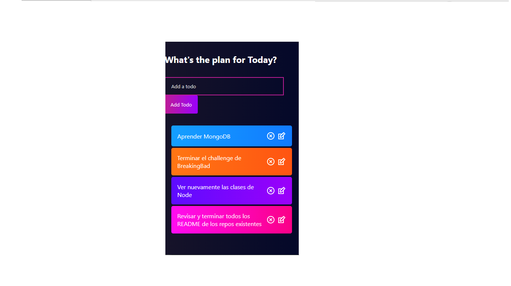
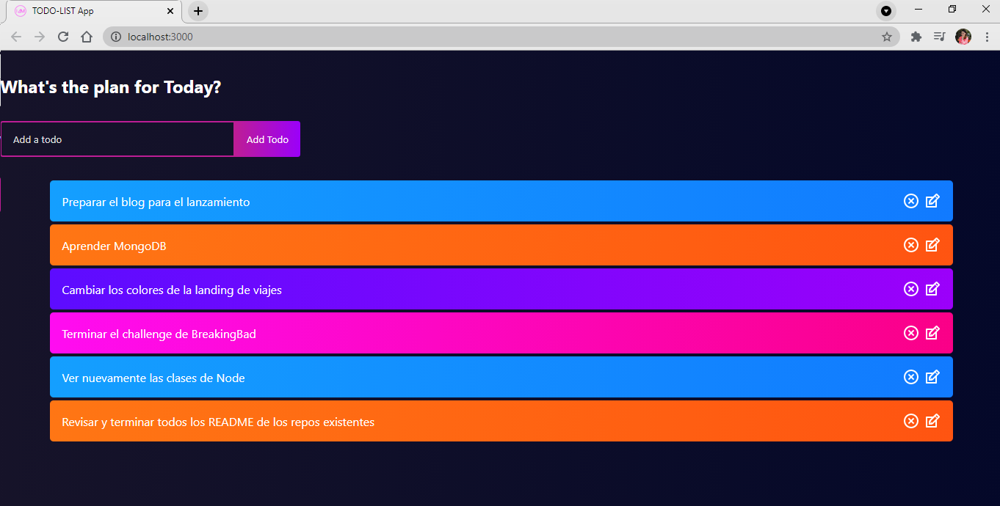

# TODO-LIST APP!!

see deployment [todo-list-app](https://listadetodos.herokuapp.com/)

Made with REACT-APP and REACT-ICONS. 

Hope you like! 🙌 

# Preview 




Creacion de la App e Instalacion de dependencias.

```
Crear app:

npx create-react-app 


iconos:

npm install react-icons --save 
```

ver documentacion en: https://www.npmjs.com/package/react-icons

 
pasos para el deployment desde consola de vscode: 
1. Descarga heroku cli.
2. verifica que tienes instalado heroku con: heroku --help
3. Crealo con el sigte enlace: $ heroku create -b https://github.com/mars/create-react-app-buildpack.git
4. git add .
5. git commit -m "loquesea"
6. luego, git push heroku. (nota: Si tienes problemas con deploy add los cambios nuevamente y utiliza para comitear: $ git commit -am "make it better")

Made with a lots of 💖 
